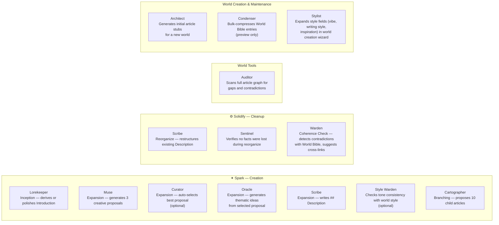
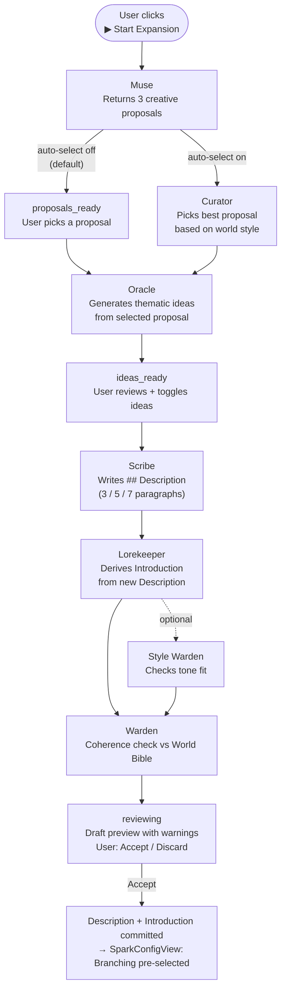
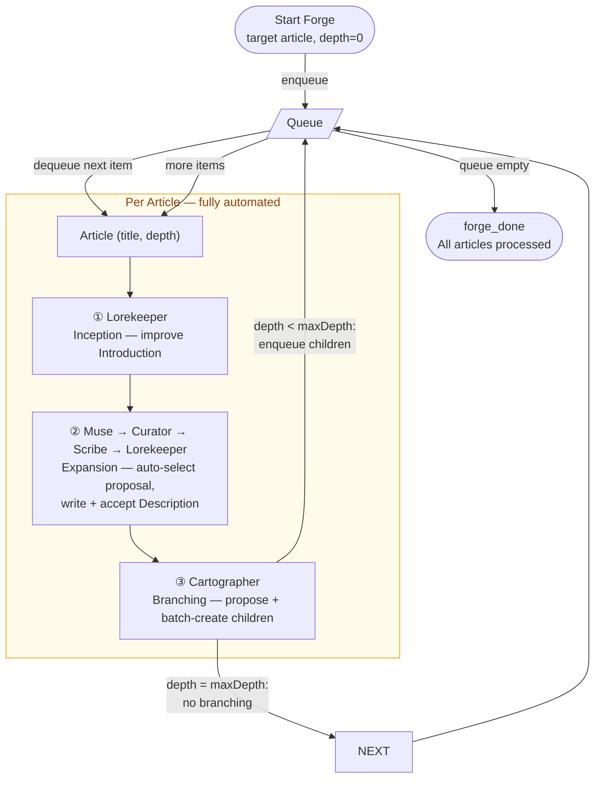
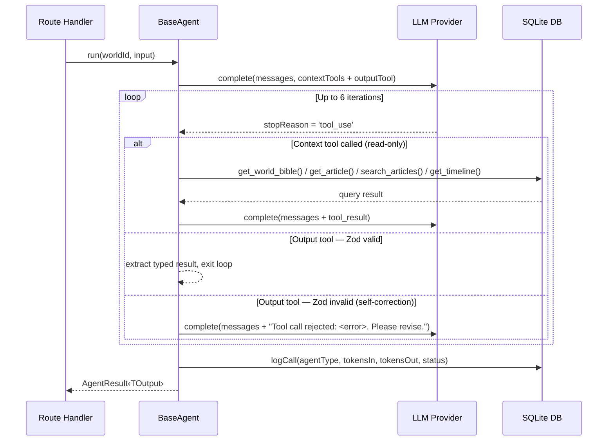

# WorldArchitect

A local-first, single-user fiction world-building webapp. Build a Wikipedia-style encyclopedia for your fictional world, assisted by a Multi-Agent System (MAS) that generates and expands content — all fully usable without any LLM configured.

---

## Quick Start

```bash
npm install
npm run dev        # server :3001 + client :5173
```

Configure an LLM provider at **Settings → Provider** in the app, or via:

```bash
curl -X PATCH http://localhost:3001/api/settings \
  -H "Content-Type: application/json" \
  -d '{"provider":"anthropic","apiKey":"sk-ant-..."}'
```

---

## License

MIT License. See [LICENSE](LICENSE).

---

## Multi-Agent System

The MAS is composed of **14 specialized agents — The Council** — accessed through three distinct UI entry points. Every agent call is user-initiated; no pipeline auto-advances without explicit approval at each step (unless the optional Forge automation is enabled).

### UI Entry Points

| Entry point | Access | Purpose |
|---|---|---|
| **✦ Spark** | Article page button | Sequential creation: Inception → Expansion → Branching |
| **⚙ Solidify** | Article page button | Cleanup: Reorganize or Coherence Check |
| **World Tools** | World overview page | Audit the full article graph |
| **Forge** | Toggle inside Spark config | Fully automated recursive expansion of an article subtree |

### The Council



### Expansion Pipeline (Spark: Expansion detail)

The Expansion task is the most complex pipeline — it runs up to five agents in sequence before producing a draft.



### Forge — Recursive Automation

The Forge runs the full Spark pipeline (Inception → Expansion → Branching) on an article and all its descendants without user interaction at each step. Configured inside the Spark panel.



**Traversal modes:** Breadth-first (`push`) processes all siblings before going deeper. Depth-first (`unshift`) dives as far as possible on the first child before backtracking. Configurable max depth (1–3 levels below root) and max children per article.

### Agent Tool-Use Loop

Every agent reasons through a typed tool-use loop. If the LLM's tool call fails Zod validation, the rejection is fed back so the model can self-correct within the same loop (up to 6 total iterations).



**Context tools** (read-only, called on demand):

| Tool | Returns |
|---|---|
| `get_world_bible()` | Full Bible rendered as `## Category / ### Title / summary` markdown |
| `get_article(articleId)` | Article body, summary, metadata |
| `search_articles(query)` | Articles matching keyword (title + body) |
| `get_timeline(worldId)` | Articles with temporal anchors, sorted chronologically |

**Output tools** (one per agent — calling it ends the loop):

| Tool | Agent |
|---|---|
| `submit_stubs` | Architect |
| `submit_proposals` | Muse |
| `submit_taste_selection` | Curator |
| `submit_ideas` | Oracle |
| `submit_description` | Scribe (expand / create_root / reorganize modes) |
| `submit_child_description` | Scribe (create_child mode) |
| `submit_introduction` | Lorekeeper |
| `submit_child_proposals` | Cartographer |
| `submit_coherence_check` | Warden |
| `submit_retention_check` | Sentinel |
| `submit_chronology` | Chronicler |
| `submit_style_check` | Style Warden |
| `submit_audit` | Auditor |
| `submit_compression` | Condenser |
| `submit_prompt_expansion` | Stylist |

### Agent Panel State Machine

```mermaid
stateDiagram-v2
    [*] --> idle

    idle --> configuring : open ✦ Spark or ⚙ Solidify panel

    state "✦ Spark mode" as spark {
        configuring --> generating : start Inception / Expansion / Branching

        state "Expansion (multi-phase)" as twophase {
            generating --> proposals_ready : Muse returns 3 proposals
            proposals_ready --> ideas_ready : select proposal → Oracle generates ideas
            ideas_ready --> expanding : confirm ideas
            proposals_ready --> expanding : select proposal (Oracle skipped)
            expanding --> reviewing : Scribe → Lorekeeper → Warden → draft ready
        }

        state "Inception / Branching (single-pass)" as singlepass {
            generating --> reviewing : Lorekeeper / Cartographer returns result
        }

        reviewing --> configuring : accept → next Spark task pre-selected
        reviewing --> idle : accept after Branching → panel closes
    }

    state "⚙ Solidify mode" as solidify {
        configuring --> generating : start Reorganize / Coherence Check
        generating --> reviewing : draft or warnings ready
        reviewing --> continuing : accept
        continuing --> configuring : start another task
        continuing --> idle : done
    }

    state "Forge mode" as forgemode {
        configuring --> forging : Start Forge
        forging --> forge_done : queue exhausted
    }

    reviewing --> idle : discard / close
    generating --> error : agent throws
    expanding --> error : agent throws
    error --> configuring : retry
    error --> idle : close
```

### Pipeline Reference

| Route | Agents called (in order) | Triggered by |
|---|---|---|
| `POST /agents/summarize` | Lorekeeper | Spark: Inception |
| `POST /agents/propose` | Muse → [Curator if auto-select] | Spark: Expansion Phase 1 |
| `POST /agents/propose-ideas` | Oracle | Spark: Expansion Phase 1 (after proposal select) |
| `POST /agents/expand` | Scribe → Lorekeeper → [Style Warden] → Warden | Spark: Expansion Phase 2 |
| `POST /agents/propose-children` | Cartographer | Spark: Branching |
| `POST /agents/reorganize` | Scribe → Sentinel → Lorekeeper → Warden | Solidify: Reorganize |
| `POST /agents/cohere` | Warden | Solidify: Coherence Check |
| `POST /agents/audit` | Auditor | World Tools: Audit World |
| `POST /agents/skeleton` | Architect | World creation wizard |
| `POST /worlds/:wid/prompt-engineer` | Stylist | World creation / World Settings |
| `POST /agents/compress` | Condenser | World Bible page |
| `POST /agents/chronology` | Chronicler → Warden | Article: Expand Chronology |

---

## Architecture

```
WorldArchitect/
├── client/          # React 18 + Vite + TypeScript
├── server/          # Node.js + Express + TypeScript
├── data/            # Created at runtime
│   └── worldarchitect.db
├── docs/
└── package.json     # npm workspaces root
```

### Document Layers per Article

Each article has four independently editable layers:

| Layer | Storage | Manual editor | AI path |
|---|---|---|---|
| Introduction (1 §) | `world_bible_entries.summary` | Inline textarea | Spark: Inception |
| Description (3–7 §) | `article_versions.body` `## Description` | TipTap | Spark: Expansion |
| Subjects (child articles) | assembled from `article_links` | "Add Subsection" dialog | Spark: Branching |
| Chronology (events) | `article_versions.body` `## Chronology` | TipTap | Article: Expand Chronology |

### Providers

The app works with `provider = none` — all data routes function normally; agent routes return `503`. API keys are stored locally and never returned unmasked.

| Provider | Notes |
|---|---|
| Anthropic | Native tool calling; real `count_tokens` API for token estimates |
| OpenAI | Native tool calling |
| Groq | Native tool calling |
| Ollama | OpenAI-compatible endpoint (model-dependent quality) |

---

## Build Status

All 16 blocks complete. Post-launch: Spark/Solidify/Forge UI redesign, recursive Forge automation, MAS reliability hardening.

| Block | Layer | Description | Status |
|---|---|---|---|
| 1 | Server | Monorepo + SQLite + health check | ✅ |
| 2 | Server | World & Category CRUD | ✅ |
| 3 | Server | Article CRUD + versioning + drafts | ✅ |
| 4 | Server | World Bible service + routes | ✅ |
| 5 | Server | Provider abstraction + call logger + settings | ✅ |
| 6 | Server | BaseAgent (tool-use loop) + Architect | ✅ |
| 7 | Server | Muse, Scribe, Lorekeeper, Cartographer, Warden, Sentinel | ✅ |
| 8 | Server | Chronicler, Condenser | ✅ |
| 9 | Server | Snapshots + ZIP export | ✅ |
| 10 | Client | React scaffolding + routing + types + API layer | ✅ |
| 11 | Client | World creation wizard + encyclopedia browser + AppShell | ✅ |
| 12 | Client | TipTap editor (Description) + Version history panel | ✅ |
| 13 | Client | Agent Panel + manual subsection creation + draft crash recovery | ✅ |
| 14 | Client | Manual Chronology editor + Timeline page | ✅ |
| 15 | Client | World Bible editor + Condenser UI + Usage panel | ✅ |
| 16 | Client | Snapshots UI + Export + TopBar nav + ConfirmDialog | ✅ |
| — | Client | Spark / Solidify / Forge UI redesign + Forge automation | ✅ |

See [`docs/build_blocks.md`](docs/build_blocks.md) for detailed per-block test checklists.
