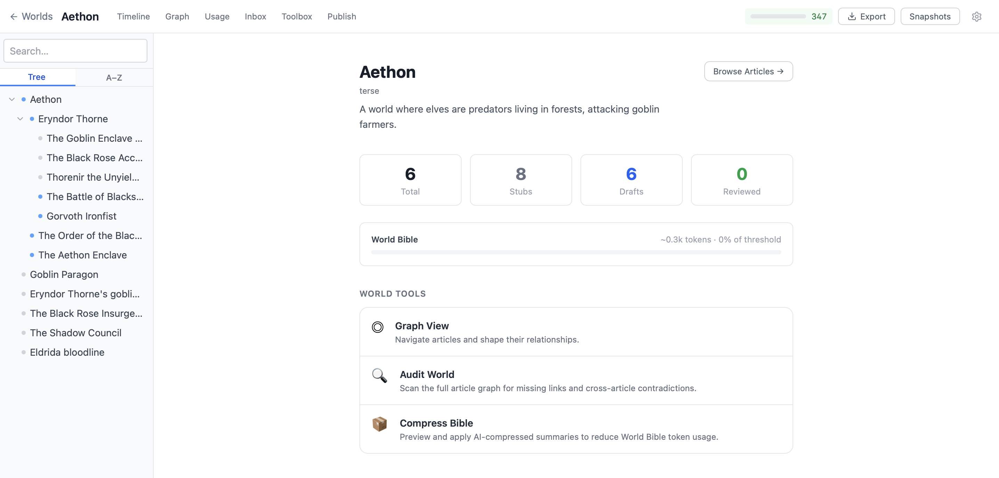
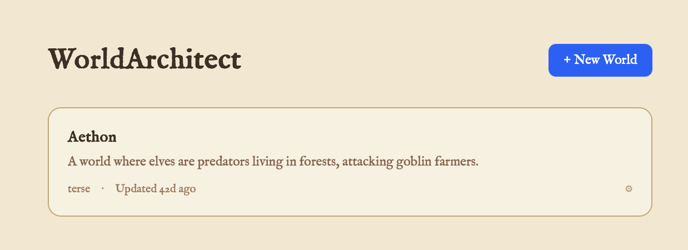
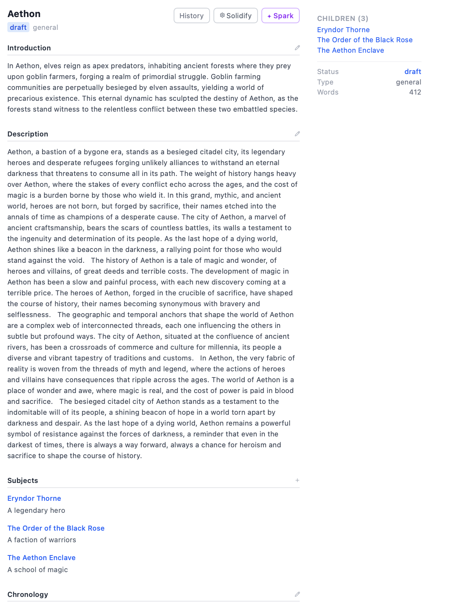
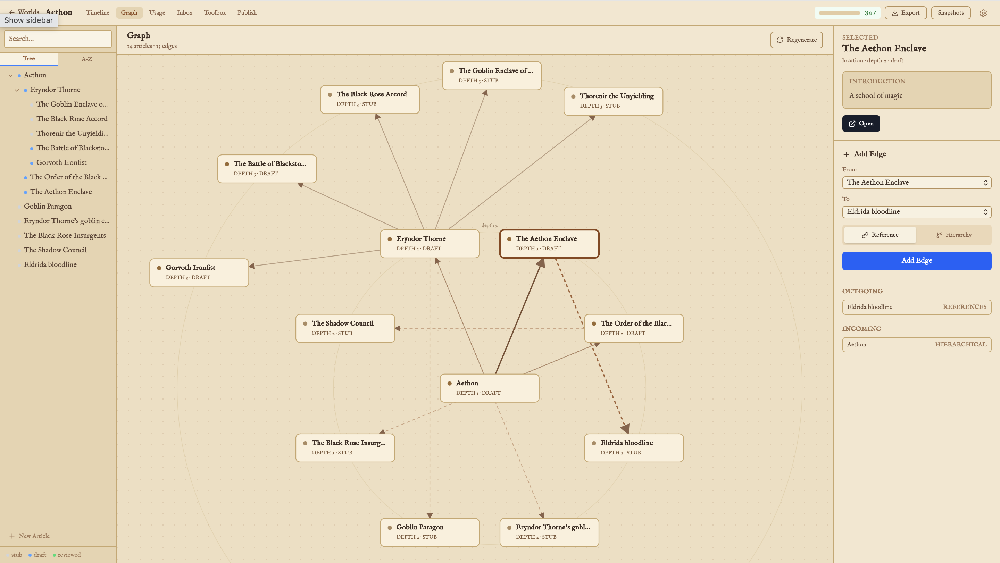
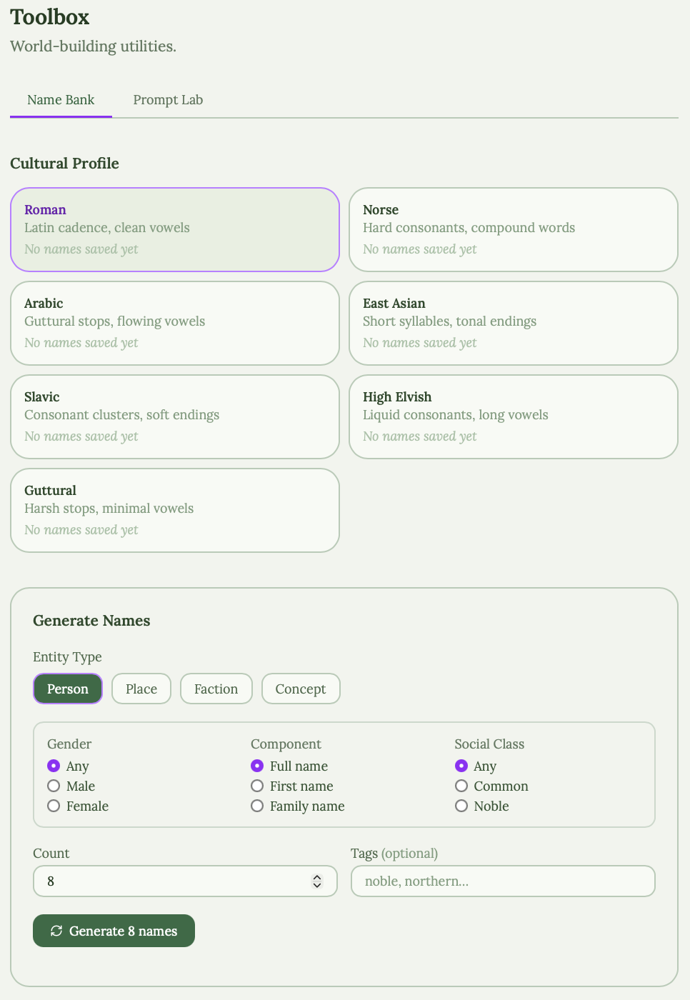

# WorldArchitect

WorldArchitect is a local-first fiction worldbuilding app for writers, game masters, and narrative designers. It helps you grow a fictional world into a structured encyclopedia: articles, categories, version history, snapshots, exportable Markdown, and optional AI-assisted expansion.

The app is fully usable without an LLM. When you do connect a provider, WorldArchitect adds a multi-agent creative system that can incept, expand, branch, consolidate, and check world documents while keeping you in control of how much gets reviewed or committed automatically.

## Project Status

WorldArchitect is currently `v0.5.0`: usable locally and prepared for hosted self-deployment, but not yet a `v1.0` stable release.

The intended release path is:

- `v0.6.0` - self-hosted beta with a tested deployment guide, backup/restore notes, and complete environment examples.
- `v1.0.0` - stable self-hostable release.
- `v2.0.0` - possible hosted SaaS direction, after the self-hosted foundation is dependable.



## Why WorldArchitect?

- **Own your world locally, by default.** In local mode your encyclopedia is stored in a local Postgres database — no account, cloud sync, or hosted backend required. An opt-in hosted multi-tenant mode is also available for self-deployment (accounts via Clerk and Postgres storage) — see [DEPLOY.md](DEPLOY.md).
- **Write with structure.** Build a browsable wiki with categories, article hierarchy, cross-links, and snapshots.
- **Use AI without surrendering control.** Expand runs use modular review gates for introductions, proposals, ideas, drafts, and child-article plans; Scribe drafts long prose directly while compact MAS decisions stay structured.
- **Grow worlds deliberately.** Expand can incept, elaborate, branch, and recurse through selected parts of the world; Consolidate can audit, clean up, and scan accepted prose for reviewable concept candidates.
- **Keep long projects durable.** Version history, crash recovery, World Bible summaries, issue checks, call logs, and ZIP export are built in.

## Features

- Local world database powered by Postgres
- World creation wizard with configurable categories and style settings
- Wikipedia-style article browser with sidebar search
- Article layers for introduction, description, and subjects
- Graph view for navigating article hierarchy and references
- Manual editing with TipTap and Markdown-oriented article content
- Version history, non-destructive reverts, and named world snapshots
- World Bible summaries used for continuity and context
- Optional multi-agent system for expansion, branching, consolidation, cleanup, auditing, naming, and publishing
- Provider support for Anthropic, OpenAI-compatible APIs, Groq, and Ollama
- Cost controls, call logs, daily caps, and provider settings
- ZIP export of the world as Markdown files

## Screenshots










## Quick Start

Requirements:

- Node.js 20+
- npm
- Docker, for the default local Postgres database

Install dependencies and start both the local API server and web client:

```bash
npm install
npm run dev
```

The server runs on `http://localhost:3001`.
The client runs on `http://localhost:5173`.

`npm run dev` starts the local Postgres service from `docker-compose.yml`, then runs the app in local mode (`APP_MODE=local`) against that database. You can start creating and editing worlds immediately with no LLM configured.

## Optional LLM Setup

WorldArchitect works with `provider = none` by default. To enable AI tools, open the app and configure a provider in **Settings -> Provider**.

You can also configure a provider through the local API:

```bash
curl -X PATCH http://localhost:3001/api/settings \
  -H "Content-Type: application/json" \
  -d '{"provider":"anthropic","apiKey":"sk-ant-..."}'
```

API keys can be entered in the app Settings screen or supplied as environment overrides. They are stored locally when entered in the app and are never returned unmasked to the client.

Set `WORLDARCHITECT_LOCAL_ONLY=1` to force Ollama-only operation and block hosted provider egress. Local-only mode can also be enabled in Settings.

## How The App Is Organized

WorldArchitect has two processes:

- `client/` - React, TypeScript, Vite, Zustand, TipTap, Tailwind
- `server/` - Node.js, Express, TypeScript, Zod, LLM provider adapters

The browser talks only to the server. The server owns the database, export system, provider settings, agent calls, and versioning.

By default (`APP_MODE=local`) the server runs unauthenticated with a single implicit user against the local Postgres service defined in `docker-compose.yml`. Hosted mode (`APP_MODE=hosted`) adds Clerk-based authentication and per-user world ownership on Postgres. Hosted mode is meant for self-deployment (Docker, Render, Railway, Fly.io), not for ordinary local development — see [DEPLOY.md](DEPLOY.md) for the required environment variables and deploy steps.

## Documentation

Public, reader-friendly docs live in [`docs/`](docs/):

- [How WorldArchitect Works](docs/how-it-works.md)
- [Article Lifecycle And Versioning](docs/articles.md)
- [Multi-Agent System Overview](docs/mas-overview.md)
- [Local-First Data And Privacy](docs/local-first.md)
- [Security Notes](docs/security.md)
- [Tech Stack](docs/tech-stack.md)
- [Hosted Deployment](DEPLOY.md)
- [Self-Hosted Operations](docs/self-hosted-operations.md)

Developer notes and older design documents are kept locally in `dev-docs/` and are intentionally ignored by Git.

## Development Commands

```bash
npm run dev              # server :3001 + client :5173
npm run dev:server       # start local Postgres + server only
npm run dev:client       # client only
npm run build -w server
npm run build -w client
npm test -w server
npm test -w client
```

## License

MIT License. See [LICENSE](LICENSE).
