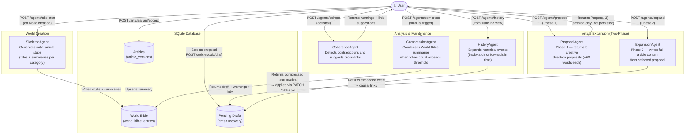
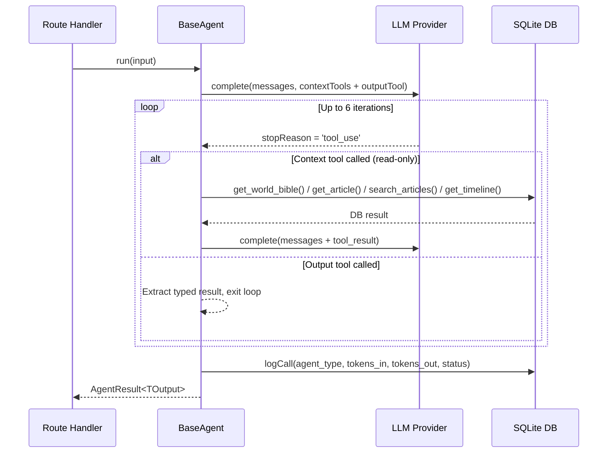
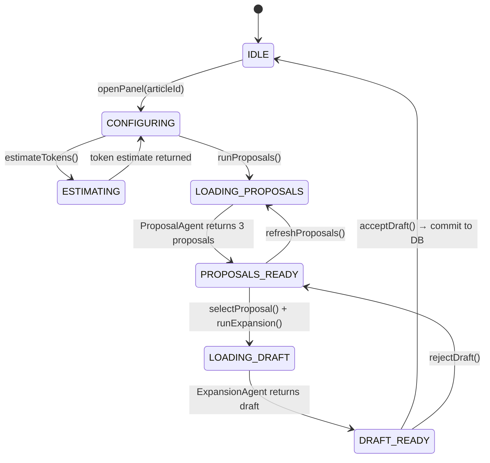

# WorldArchitect

A local-first, single-user fiction world-building webapp. Build a Wikipedia-style encyclopedia for your fictional world, assisted by a Multi-Agent System (MAS) that generates and expands content — all fully usable without any LLM configured.

---

## Multi-Agent System

The MAS is composed of six specialized agents. Every agent call is a discrete, user-initiated HTTP POST — no agent auto-chains into another. Cost overruns are architecturally impossible.

### Agent Overview



### Agent Tool-Use Pattern

Every agent interacts with the world through a typed tool-use loop — never raw JSON prompts.



**Context tools** (read-only DB reads — called on demand during reasoning):

| Tool | Returns |
|---|---|
| `get_world_bible()` | Full Bible rendered as `## Category / ### Title / summary` markdown |
| `get_article(articleId)` | Article body, summary, metadata |
| `search_articles(query)` | Articles matching keyword (title + body) |
| `get_timeline(worldId)` | Articles with temporal anchors, sorted chronologically |

**Output tools** (one per agent — calling it ends the loop):

| Tool | Agent |
|---|---|
| `submit_stubs(stubs[])` | SkeletonAgent |
| `submit_proposals(proposals[3])` | ProposalAgent |
| `submit_expansion(body, summary, warnings[], links[], anchor?)` | ExpansionAgent |
| `submit_coherence_check(warnings[], links[])` | CoherenceAgent |
| `submit_history_expansion(body, summary, causalLinks[], timelinePosition)` | HistoryAgent |
| `submit_compression(entries[])` | CompressionAgent |

### Expansion Phase State Machine



---

## Architecture

```
WorldArchitect/
├── client/          # React 18 + Vite + TypeScript (Blocks 10–16)
├── server/          # Node.js + Express + TypeScript (Blocks 1–9)
├── data/            # Created at runtime
│   └── worldarchitect.db
├── docs/
└── package.json     # npm workspaces root
```

**Start:** `npm run dev` (starts server on :3001 and client on :5173 via `concurrently`)

### Providers

The app works with `provider = none` — all data routes function normally; agent routes return `503`. When a provider is configured, keys are stored locally and never returned unmasked.

| Provider | Tool calling |
|---|---|
| Anthropic | Native (`tools` param) |
| OpenAI | Native (`tools` param) |
| Groq | Native (`tools` param) |
| Ollama | Prompt-based JSON fallback (model-dependent) |

---

## Build Status

| Block | Layer | Description | Status |
|---|---|---|---|
| 1 | Server | Monorepo + SQLite + health check | ✅ Done |
| 2 | Server | World & Category CRUD | ✅ Done |
| 3 | Server | Article CRUD + versioning + drafts | ✅ Done |
| 4 | Server | World Bible service + routes | ✅ Done |
| 5 | Server | Provider abstraction + call logger + settings | ✅ Done |
| 6 | Server | BaseAgent (tool-use loop) + SkeletonAgent | ✅ Done |
| 7 | Server | Creator + Redactor + CoherenceAgent + RetentionAgent | 🔲 Next |
| 8 | Server | Historian + BibleCompressor | 🔲 Pending |
| 9 | Server | Snapshots + ZIP export | 🔲 Pending |
| 10–16 | Client | Full React frontend | 🔲 Pending |

See [`docs/build_blocks.md`](docs/build_blocks.md) for detailed checklists per block.
