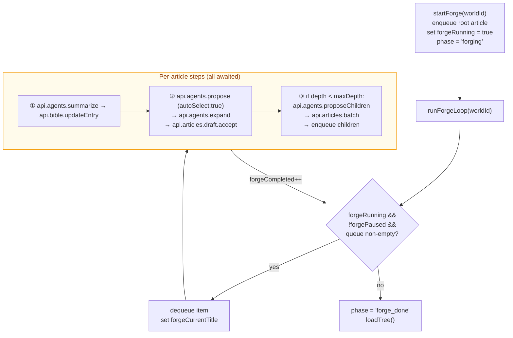

# WorldArchitect — Developer Reference

This document covers internals, debugging, and improvement notes. For user-facing docs, see [README.md](README.md).

---

## Dev Setup

### Prerequisites

| Tool | Version | Notes |
|---|---|---|
| Node.js | 20.x LTS | `node --version` |
| npm | 10.x | comes with Node 20 |
| SQLite | any | only if you want to inspect the DB directly |

No Docker. No Rust. No Apple Silicon required. Runs on x86 Mac.

### Start

```bash
npm install                  # installs root + both workspaces
npm run dev                  # concurrently: server :3001 + Vite :5173
npm run dev:server            # server only
```

### Type-check (no emit)

```bash
npx tsc --noEmit -p server/tsconfig.json
npx tsc --noEmit -p client/tsconfig.json
```

### Inspect the database

```bash
sqlite3 data/worldarchitect.db
.tables
.schema articles
SELECT * FROM call_log ORDER BY created_at DESC LIMIT 10;
```

### Wipe and restart

```bash
rm data/worldarchitect.db    # schema is re-applied on next server start
```

### Environment variables

None required. All configuration is stored in `provider_settings` (DB singleton). API keys are set via `PATCH /api/settings` and stored locally.

---

## Backend Architecture

### Request lifecycle

```
HTTP request
  → Express router (routes/)
  → optional requireLLM middleware (503 if provider = none)
  → optional daily cap check (checkDailyCap)
  → business logic / agent pipeline
  → DB write (better-sqlite3, synchronous)
  → JSON response
```

All DB calls are **synchronous** (better-sqlite3). No connection pool, no ORM, no migrations — schema applied idempotently on boot via `CREATE TABLE IF NOT EXISTS`.

### DB singleton

[server/src/db/index.ts](server/src/db/index.ts) returns a module-level singleton. WAL mode and `PRAGMA foreign_keys = ON` are set once at startup. All routes import `getDb()` directly.

### Provider abstraction

[server/src/providers/index.ts](server/src/providers/index.ts) — `getProvider()` reads `provider_settings` from the DB and returns an `LLMProvider`. Called **per request** (not cached), so provider switches take effect immediately.

```
provider_settings (DB singleton)
  → getProvider() → AnthropicProvider | OpenAICompatibleProvider
  → provider.complete(messages, options, tools) → CompletionResult
  → provider.estimateTokens(text) → number
```

Anthropic uses the real `count_tokens` API. OpenAI-compatible providers use `chars / 4`.

### Article body format

Every article body follows this fixed two-section format:

```markdown
## Description

[content or empty for stubs]

## Chronology

[content or empty]
```

`splitSections(body)` and `mergeSections(description, chronology)` in [server/src/services/sections.ts](server/src/services/sections.ts) are the canonical parsers. All agents and routes go through these — never string-split the body directly.

### World Bible

The Bible is a flat table (`world_bible_entries`) with one row per article. `renderBible(worldId)` assembles it into a markdown string grouped by category — this is the primary LLM context for most agents.

Token count is materialized in `world_bible_meta` and updated after every Bible write.

### Archivist (context assembly)

[server/src/services/archivist.ts](server/src/services/archivist.ts) — `buildContextPackage(worldId, articleId, options?)` assembles the tiered context passed to agents before each agent call:

| Mode | Tier order |
|---|---|
| `default` | parents → siblings → fixed points → referenced |
| `expand_chronology` | temporal neighbours → children → parents → siblings → fixed points |
| `propose_children` | children → parents → siblings |
| `reorganize` | parents → siblings → full Bible |

The package is pre-built before agent instantiation and passed in as plain data — agents do not call `buildContextPackage` themselves.

### BaseAgent tool-use loop

[server/src/agents/base.ts](server/src/agents/base.ts) — the loop runs up to 6 iterations:

1. Build initial messages (system prompt + user message with context package)
2. Call `provider.complete(messages, { maxTokens: this.getMaxTokens() }, allTools)` where `allTools = contextTools + [outputTool]`
3. If `stopReason = 'tool_use'`:
   - **Context tool called:** execute DB read, append `tool_result`, loop
   - **Output tool called, valid:** Zod validates → extract typed result, exit loop
   - **Output tool called, invalid:** append rejection message with Zod error so the LLM can self-correct, loop continues
4. Log call to `call_log` (success or error, inside `finally`)

If 6 iterations are exhausted without a valid output tool call, the agent throws and logs `error`.

`getMaxTokens()` defaults to 4096. ScribeAgent overrides to 8192 to support long descriptions (7 paragraphs).

### The Council — Agent Roster

| Agent type | Class | Output tool | Role |
|---|---|---|---|
| `architect` | ArchitectAgent | `submit_stubs` | Generates initial article stubs for a new world |
| `muse` | MuseAgent | `submit_proposals` | 3 creative direction proposals for Expansion |
| `curator` | CuratorAgent | `submit_taste_selection` | Auto-selects best proposal based on world style |
| `oracle` | OracleAgent | `submit_ideas` | Generates thematic ideas from a selected proposal |
| `scribe` | ScribeAgent | `submit_description` / `submit_child_description` | Writes `## Description` (4 modes) |
| `lorekeeper` | LorekeeperAgent | `submit_introduction` | Derives / polishes Introduction from Description |
| `style_warden` | StyleWardenAgent | `submit_style_check` | Checks tone consistency with world style config |
| `cartographer` | CartographerAgent | `submit_child_proposals` | Proposes 10 child article stubs |
| `warden` | WardenAgent | `submit_coherence_check` | Detects contradictions, suggests cross-links |
| `sentinel` | SentinelAgent | `submit_retention_check` | Verifies reorganize preserved all facts |
| `chronicler` | ChroniclerAgent | `submit_chronology` | Writes `## Chronology` section |
| `condenser` | CondenserAgent | `submit_compression` | Bulk-compresses World Bible entries (preview only) |
| `auditor` | AuditorAgent | `submit_audit` | Scans full article graph for gaps and contradictions |
| `stylist` | StylistAgent | `submit_prompt_expansion` | Expands style fields in world creation wizard |

### Pipeline Coordinator

[server/src/agents/director.ts](server/src/agents/director.ts) — `PipelineCoordinator` orchestrates multi-agent pipelines. Each route handler calls the coordinator, which calls agents in sequence and combines results. No agent calls another agent directly.

---

## Client Architecture

### Spark / Solidify / Forge UI

The AI Agent Panel is a fixed right-side drawer (`AgentPanel.tsx`) opened from article pages. Two separate buttons open it in different modes:

- **✦ Spark** → opens with `agentPanelMode = 'spark'` → shows `SparkConfigView`
- **⚙ Solidify** → opens with `agentPanelMode = 'solidification'` → shows `SolidificationConfigView`

**SparkConfigView** has three task cards: Inception, Expansion, Branching. Cards are gated:
- Inception: always available
- Expansion: requires Introduction ≥ 15 words
- Branching: requires Introduction ≥ 15 words AND Description ≥ 40 words

After each accepted step, the panel returns to `SparkConfigView` with the next task pre-selected (e.g., accept Inception → Expansion card is now selected). After Branching is accepted, the panel closes.

**Auto-chain** toggle: skips the "return to config" step and immediately runs the next Spark task after each acceptance. Intermediate review UIs (proposals, ideas, draft) still show — only the navigation gate is skipped.

**SolidificationConfigView** has two task cards: Reorganize, Coherence Check. No prerequisite gates.

### Forge Loop

The Forge runs fully automated inside `agentSlice.ts` using a closure over Zustand `get`/`set`:



BFS: children are `push`ed (processed after all current-depth siblings).
DFS: children are `unshift`ed (processed immediately as first-in-queue).

`pauseForge()` sets `forgePaused = true`; the loop breaks at the next iteration check. `resumeForge(worldId)` clears the flag and re-enters `runForgeLoop` from the current queue head. `stopForge()` sets `forgeRunning = false` and clears the queue.

### Agent State Machine — Key State Fields

```typescript
agentPhase:            AgentPhase          // driving field — AgentPanel routes on this
agentPanelMode:        'spark' | 'solidification'
agentPipelineType:     PipelineType        // which pipeline is running
agentProposals:        Proposal[]          // Muse output
agentSelectedProposalIndex: number | null
agentIdeas:            IdeaItem[]          // Oracle output
agentSelectedIdeas:    IdeaItem[]
agentChildProposals:   ChildProposal[]     // Cartographer output
agentDraftResult:      DraftContent | null // pending draft content
agentStyleCheck:       StyleWardenResult | null

// Forge runtime
forgeRunning:          boolean
forgePaused:           boolean
forgeQueue:            ForgeItem[]
forgeLog:              ForgeLogEntry[]
forgeCompleted:        number
forgeTotal:            number
```

---

## Data Flow: Expand an Article (full Expansion pipeline)

```
1. POST /agents/propose  { articleId, pipelineType: 'expand_description' }
   Archivist.buildContextPackage(...)
   Muse.run() → { proposals: [3 × { title, direction }] }
   [CuratorAgent.run() if autoSelect=true] → { autoSelectedIndex }
   → response (not persisted)

2. User selects proposal [i] → Oracle runs
   POST /agents/propose-ideas  { articleId, selectedProposal, introduction }
   Oracle.run() → { ideas: IdeaItem[] }
   → response (not persisted)

3. User toggles ideas, clicks Expand
   POST /agents/expand  { selectedProposalIndex, proposals, selectedIdeas, pipelineType }
   Scribe.run() → { description }
   Lorekeeper.run(description) → { introduction }
   [StyleWarden.run() if runStyleWarden=true] → { styleCheck }
   Warden.run(newContent) → { warnings[], suggestedLinks[] }
   pending_drafts.upsert({ articleId, pipelineType, draftContent })
   → response to client

4. User reviews draft, clicks Accept
   POST /articles/:aid/accept
   mergeSections(newDescription, existingChronology) → body
   article_versions.insert(body)
   world_bible_entries.upsert(introduction)
   pending_drafts.delete(articleId)
```

---

## Data Flow: Crash Recovery

If the browser closes between step 3 and step 4 above:
- `pending_drafts` still has the row
- On next `GET /articles/:aid`, the server returns `pendingDraft` in the response
- The client shows `DraftCrashRecovery` banner ("Resume draft?")
- User can resume from the review step without re-running agents

---

## Known Weaknesses & Improvement Suggestions

### 1. No streaming — long agent calls block UI

**Problem:** Agent calls (especially Expansion with 4+ context tool iterations) can take 10–30 seconds with no intermediate feedback.

**Fix:** Use SSE (`text/event-stream`) on agent routes and stream intermediate events (iteration count, current step, token estimate). `AgentLoadingView` exists; it needs a real progress signal.

**Complexity:** Medium. BaseAgent needs an optional `onProgress` callback; the route pipes it to SSE.

---

### 2. Skeleton/Architect has no context tools — world description is the only signal

**Problem:** ArchitectAgent generates stubs from seed text alone. If you run it after manually expanding several articles, new stubs ignore what already exists in the Bible.

**Fix:** Give ArchitectAgent the same context tools as other agents (specifically `get_world_bible`). Prompt change: "generate stubs that complement what already exists."

**Complexity:** Low. One-line change in `architect.ts` to include context tools, plus a prompt tweak.

---

### 3. Warden (CoherenceAgent) runs even when the Bible has almost no content

**Problem:** On a fresh world with 2–3 articles, Warden has almost nothing to check against and reliably returns empty results — but still costs tokens.

**Fix:** Gate the Warden call: skip it if `world_bible_entries` count < N (e.g., 5) or Bible token count < 500.

**Complexity:** Trivial. One condition in the pipeline coordinator.

---

### 4. No deduplication of pending_drafts across pipeline types

**Problem:** `pending_drafts` has a unique constraint on `article_id`. Starting an `expand_description` pipeline, abandoning it, then starting `expand_chronology` on the same article silently overwrites the old draft with a wrong `pipelineType`.

**Fix:** Add `pipeline_type` to the unique constraint: `UNIQUE(article_id, pipeline_type)`. Update the upsert accordingly.

**Complexity:** Low. Schema migration + update the upsert in the route handler.

---

### 5. Condenser (BibleCompressor) has no ceiling on entries

**Problem:** On a 200-article world, CondenserAgent sends all 200 summaries in one call. This can exceed context windows.

**Fix:** Chunk by token count (e.g., max 8k tokens per batch), run multiple sequential calls, merge results.

**Complexity:** Medium. Modify `condenser.ts` to chunk; add a loop in the coordinator.

---

### 6. No validation that article body sections are well-formed before agent calls

**Problem:** If an article body is manually edited to break the `## Description / ## Chronology` format, `splitSections` returns empty strings and the agent runs against blank content.

**Fix:** Validate `splitSections` output in the pipeline coordinator before calling agents. Return 400 with a clear message if the format is broken.

**Complexity:** Trivial.

---

### 7. Article search is naive full-text scan

**Problem:** `search_articles` in context tools does `LIKE %query%` on title and body. On large worlds (200+ articles), this is a full table scan.

**Fix:** Enable SQLite FTS5 (`CREATE VIRTUAL TABLE articles_fts USING fts5(...)`) for both context tool search and the sidebar search endpoint.

**Complexity:** Medium. Schema addition + update two query sites.

**Severity:** Low-medium — only becomes a problem at significant scale.

---

### 8. ⚠ Forge loop runs in the browser — data loss risk on tab close

**Problem:** The entire Forge automation (queue, progress, per-article pipeline calls) lives in Zustand state and runs as a long-lived async function in the client. If the browser tab is closed, navigated away from, or crashes mid-run, the queue is lost. Any articles that were partially processed (Inception done, Expansion not yet accepted) are left in an indeterminate state with potentially orphaned `pending_drafts` rows.

**Fix:** Move the Forge loop to the server. Add a `forge_jobs` table (world_id, queue JSON, status, created_at). The client POSTs a job spec and polls status via SSE or periodic GET. The server processes the queue synchronously in the background, committing each article as it completes. The client `ForgeProgressView` becomes a live reader of job state rather than the job runner.

**Complexity:** High. Requires server-side job architecture, SSE endpoint, and client polling — but the per-article steps are already clean server API calls, so the logic itself doesn't change much.

**Severity:** High — this is the most structurally fragile part of the system. For a local single-user app the risk is manageable (user keeps the tab open), but it is a real data-loss vector and should be flagged clearly.

---

### 9. No prompt caching — World Bible tokens resent on every agent call

**Problem:** Every agent call re-sends the full World Bible (potentially 10,000+ tokens) as part of the system or user message. Anthropic's cache-control headers (`cache_control: { type: "ephemeral" }`) allow caching of static prefixes across calls within a 5-minute window, reducing input token costs by ~90% for the cached portion. At 50+ articles the Bible dominates token costs.

**Fix:** In `AnthropicProvider`, mark the Bible section of the system message (or the static system prompt prefix) with `cache_control`. The Anthropic SDK supports this via the `cache_control` field on message content blocks. OpenAI-compatible providers do not support this — make it conditional on `this.name === 'anthropic'`.

**Complexity:** Low-medium. Requires restructuring how messages are built so the static (Bible) portion appears as a distinct content block that can be marked for caching. No schema changes.

**Severity:** High for cost at scale — no functional impact, but a professional deployment would require this.

---

### 10. Max 6 iterations is too low for agents that need heavy context reads

**Problem:** `MAX_ITERATIONS = 6` in `base.ts` is shared by all agents. An Expansion call that reads the world bible, fetches the target article, fetches the parent article, and fetches two siblings has consumed 4 iterations before writing a single word. It has at most 2 attempts to call the output tool. If the first output attempt fails validation and triggers self-correction, the loop is already exhausted.

**Fix:** Raise the default to 10 and add a `protected getMaxIterations(): number { return 10; }` override on `BaseAgent` (same pattern as `getMaxTokens`). Agents that only ever call the output tool directly (e.g., Curator, Sentinel) can stay at 6 or fewer. Scribe and Lorekeeper should use 10+.

**Complexity:** Trivial. Two lines of change in `base.ts`, optional overrides in specific agents.

**Severity:** Medium — triggered the original "scribe did not produce output within 6 iterations" bugs. Self-correction adds robustness but does not fully compensate for an iteration budget that was already mostly spent on context reads.

---

### 11. `StylistAgent` and `StyleWardenAgent` naming collision

**Problem:** Two agents share "style" in their identity but do completely unrelated things: `StylistAgent` (`agentType: 'stylist'`) is a prompt engineer that expands world creation style fields; `StyleWardenAgent` (`agentType: 'style_warden'`) checks that generated content matches the world's tone. Any developer encountering both for the first time will confuse them, and logs that show `stylist` and `style_warden` side-by-side are opaque.

**Fix:** Rename `StylistAgent` to `PromptEngineerAgent` (`agentType: 'prompt_engineer'`) and update its file, route, output tool name (`submit_prompt_expansion` → `submit_prompt_engineering`), and call log entries accordingly.

**Complexity:** Low. Pure rename — no logic changes. Existing `call_log` rows for `stylist` become historical.

**Severity:** Low — no functional impact, but a consistent source of confusion in code review and debugging.

---

### 12. World Bible scales poorly as the primary agent context

**Problem:** `renderBible(worldId)` produces a single flat markdown string containing every article's Introduction, passed wholesale to most agents. At 300+ articles this string can exceed 40,000 tokens, approaching context window limits for some models. There is no semantic retrieval, no summarisation of distant articles, and no way for an agent to efficiently find the 5 most relevant Bible entries for a given task — it either gets everything or nothing.

**Fix (incremental):** In the short term, add a `maxTokens` cap to `renderBible` that truncates low-priority entries (e.g., deep stub articles) if the total exceeds a threshold. In the longer term, replace the flat render with a retrieval step: the Archivist pre-selects the N most relevant Bible entries using TF-IDF or embeddings before assembling the context package. This keeps Bible context tight regardless of world size.

**Complexity:** Medium (cap) to High (retrieval). The cap is safe and cheap to implement; the retrieval approach would require an embeddings store (e.g., SQLite-vec or a local HNSW index) which is a significant dependency addition.

**Severity:** Medium now, High at 200+ articles — not a current problem for typical worlds, but the architectural decision to use a flat full-Bible dump will eventually hit a hard wall.

---

## Testing Suggestions

No automated test suite. Ordered by value/effort ratio.

### 1. Unit test `sections.ts` — highest priority

```typescript
test('round-trip preserves content', () => {
  const body = '## Description\n\nhello\n\n## Chronology\n\nworld';
  const { description, chronology } = splitSections(body);
  expect(mergeSections(description, chronology)).toBe(body);
});
```

### 2. Unit test `archivist.ts` — high priority

Mock the DB and assert that the right articles appear in the right tiers for each mode. Wrong tier ordering silently corrupts agent context.

### 3. Integration test agent routes with a mock provider

```typescript
class MockProvider implements LLMProvider {
  async complete(_msgs: ChatMessage[], _opts: CompletionOptions, tools: Tool[]) {
    const outputTool = tools.find(t => t.name.startsWith('submit_'))!;
    return {
      content: '', toolCalls: [{ id: '1', name: outputTool.name, input: MOCK_OUTPUT }],
      stopReason: 'tool_use' as const, tokensIn: 10, tokensOut: 10,
    };
  }
  async estimateTokens(text: string) { return text.length / 4; }
}
```

### 4. Integration test `POST /articles/:aid/accept` dispatch

This endpoint has 5 branches by `pipelineType`, each writing to different tables. Test each branch against a real in-memory SQLite instance.

### 5. Snapshot test `renderBible` output

The Bible string is the primary LLM context. Any formatting change silently changes agent behavior. Snapshot-test the markdown format.

---

## Key Files to Know

| File | Why it matters |
|---|---|
| [server/src/db/schema.ts](server/src/db/schema.ts) | All 13 tables — read before touching any DB logic |
| [server/src/agents/base.ts](server/src/agents/base.ts) | Tool-use loop with self-correction — every agent runs through this |
| [server/src/services/sections.ts](server/src/services/sections.ts) | `splitSections` / `mergeSections` — article body format contract |
| [server/src/services/archivist.ts](server/src/services/archivist.ts) | Context assembly — shapes what every agent sees |
| [server/src/agents/director.ts](server/src/agents/director.ts) | Pipeline coordinator — orchestrates multi-agent chains |
| [server/src/routes/agents.ts](server/src/routes/agents.ts) | All agent route handlers and Zod validation schemas |
| [client/src/stores/agentSlice.ts](client/src/stores/agentSlice.ts) | Client-side agent state machine + Forge loop |
| [client/src/components/agent/SparkConfigView.tsx](client/src/components/agent/SparkConfigView.tsx) | Spark entry point — task gating, Forge config |
| [client/src/components/agent/SolidificationConfigView.tsx](client/src/components/agent/SolidificationConfigView.tsx) | Solidify entry point |
| [client/src/lib/api.ts](client/src/lib/api.ts) | All typed fetch wrappers — add endpoints here |

---

## Adding a New Agent — Checklist

1. Add prompt file: `server/src/prompts/<name>.ts`
2. Add output tool to `OUTPUT_TOOLS` in [server/src/tools/output.ts](server/src/tools/output.ts)
3. Create agent class extending `BaseAgent` in `server/src/agents/<name>.ts`
4. Add route in [server/src/routes/agents.ts](server/src/routes/agents.ts)
5. If context tools are needed, they are defined in [server/src/tools/context.ts](server/src/tools/context.ts) — pass them via `getContextTools()` override
6. If the agent writes long content, override `getMaxTokens()` to return a higher value (e.g., 8192)
7. If the result needs a new UI flow, add a phase to `agentSlice.ts` and a view component under `client/src/components/agent/`
8. Type-check: `npx tsc --noEmit -p server/tsconfig.json`
