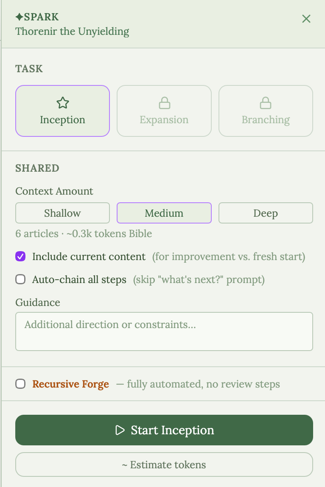
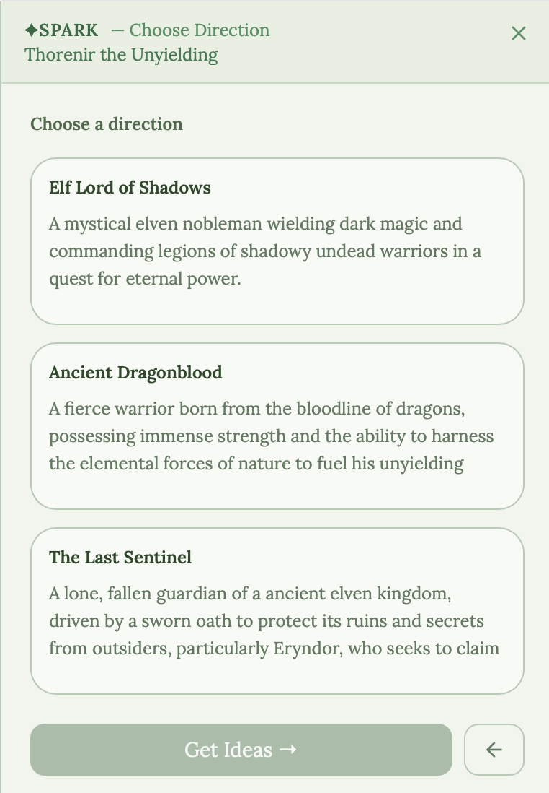
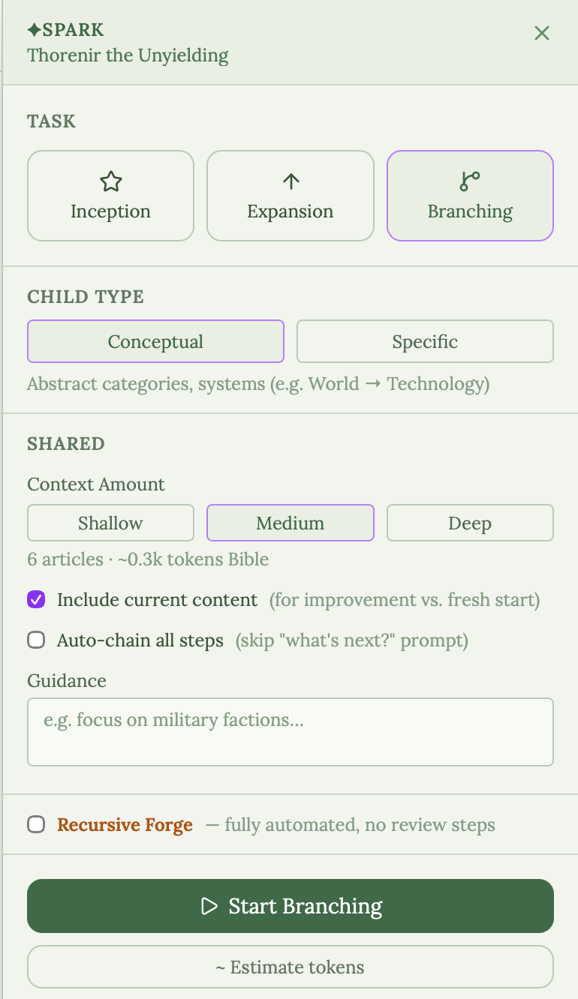

# Multi-Agent System Overview

WorldArchitect's Multi-Agent System, or MAS, is an optional creative assistant for building and maintaining a fictional encyclopedia.

It is not required to use the app. You can create, edit, version, snapshot, and export worlds without any LLM provider configured.

## Core Principle

The MAS is designed around user control. Agents can propose, draft, summarize, check, or reorganize content, but important changes are reviewed by the user before they become part of the world.

Expand is the main growth surface for the MAS. It can work on one document or continue through a branch of the world, depending on the run settings the user chooses.

An Expand run is configured by:

- **Location** - the selected document, a subtree rooted at that document, or eventually broader world scopes.
- **Start step** - Inception, Expansion, or Branching.
- **Continuation** - one step, finish the selected document, or recurse into created children.
- **Validation level** - Manual, Assisted, or Autopilot.
- **Existing-content behavior** - create only if empty, improve current content, replace, or skip existing content.
- **Quality checks** - grounding, continuity, deduplication, and style checks where applicable.

Older screenshots and a few internal names still use Spark and Forge. In the current product model, those are not separate systems. They are policies over Expand:

- **Manual Expand** pauses at each meaningful review gate so the user can edit, accept, or reject generated introductions, proposals, ideas, drafts, and child-article plans.
- **Assisted Expand** can auto-select low-risk directions or ideas while still pausing before important article-changing outputs are committed.
- **Autopilot Expand** can auto-select, continue, and commit during the run.

The shared MAS contract is location, intent, autonomy mode, review policy, and commit policy. This keeps workflows modular while making it clear when the system should ask the user, create a pending draft, or commit automatically.

Long prose and compact decisions use different output styles. Scribe writes article descriptions as normal assistant prose so long drafts do not have to be serialized inside provider function-call JSON. Compact decisions still use structured tool calls for proposal selection, checks, and Consolidate concept extraction.

## Main Entry Points

### Expand

Expand grows the world. It can:

- Improve or derive an introduction through Inception
- Generate creative proposals
- Expand a document description through Scribe prose drafting
- Suggest or create child documents through Branching
- Continue from one step to the next
- Recurse into newly created children when configured to do so

Expand is best when you want to grow a world deliberately while choosing how much control the MAS should have.

For a new or empty document, Inception can help establish a usable introduction. For an existing document, Expansion can propose creative directions before Scribe drafts fuller description prose. Expand does not create inferred concept documents; later Consolidate scans accepted prose for reviewable concept candidates.

Branching can propose child subjects when a document should become a richer hierarchy. This is useful for turning a broad concept into connected people, places, factions, events, or ideas. `finish_document` runs can continue from an accepted Expansion draft into Branching for the selected document; recursive runs can also queue created children in breadth-first or depth-first order.

Expand runs execute on the server as resumable runs with progress logs, pause, resume, stop controls, and persisted review items. When a run reaches a user gate it enters `needs_input`; the selected run view shows the pending decision inside Expand, then resumes the server graph from its checkpoint after the user accepts or rejects the item.

Review gates are modular rather than agent-specific. The current Expand graph can ask for introduction review, proposal selection, idea selection, draft review, or child selection. Selection gates allow the user to edit the proposed text before accepting, so a manual choice can still refine what the following agents receive. When a Manual or Assisted draft is accepted, the server saves it before any following Branching step runs.

### Consolidate

Consolidate is for cleanup and review. It can:

- Reorganize rough article prose
- Check for coherence issues
- Scan accepted prose for reviewable concept candidates
- Preserve facts during cleanup
- Surface style or consistency warnings

Consolidate is best after an article or world already has useful material but needs structure, consistency, graph cleanup, or polish. Concept scanning is deliberately review-first: the Mention Extractor creates pending candidates, and documents are created or linked only when the user accepts a candidate.

### World Tools

World-level tools review the encyclopedia as a graph. They can look for missing links, conceptual gaps, and broad consistency issues.

## What The Agents Do

WorldArchitect uses specialized agents for different jobs:

- **Architect** creates initial article stubs during world creation.
- **Muse** proposes creative directions.
- **Curator** can select a proposal automatically.
- **Oracle** suggests thematic ideas.
- **Researcher** extracts constraints before drafting.
- **Scribe** writes article descriptions as prose instead of long function-call payloads.
- **Mention Extractor** extracts compact structured concept candidates during Consolidate scans. It does not run during Expand and does not create documents by itself.
- **Continuity Editor** checks draft contradictions before acceptance.
- **Lorekeeper** writes compact World Bible introductions.
- **Cartographer** proposes child articles.
- **Warden** checks coherence against the world.
- **Sentinel** checks that reorganized text did not lose facts.
- **Style Warden** reviews tone and prose fit.
- **Linter** finds article issues after saves.
- **Fixer** helps resolve individual issues.
- **Auditor** reviews the world graph.
- **Condenser** shortens overly long World Bible entries.
- **Stylist** expands world style notes into more useful writing guidance.

Chronology is currently a manual data feature, not an agent workflow.

## Cost And Safety Controls

WorldArchitect is intentionally explicit about AI use:

- Agent routes are disabled when no provider is configured.
- Calls are logged, with a Usage page showing a raw call-by-call log, a per-agent
  rollup (calls, average tokens, average tool-use turns), and a per-pipeline-run
  view grouping the agent calls behind a single Expand or Consolidate action together.
- Daily caps can be configured.
- Expand review gates can stop a run before important generated content is committed in Manual and Assisted validation modes.
- Long Scribe drafts are logged as prose responses; compact agent outputs remain structured for validation.
- Version history makes accepted changes reversible.
- Snapshots can preserve an entire world before large operations.
- Repeated calls to the same agent within a world are cheaper than they look — the
  system prompt is cached (Anthropic provider), so the model doesn't pay full price
  to re-read the same instructions on every turn or every subsequent call.

The goal is not to replace the writer. The goal is to make a complex fictional world easier to grow, inspect, and maintain.

## Context Package Boundary

Agents receive curated article context from the server rather than reading the database directly. Today, that package contains the target article, parents, siblings, children, fixed points, temporal neighbors, referenced articles, and an estimated token budget.

The context package boundary keeps agent workflows modular: agents consume one curated package instead of many low-level database, vector, and metadata tools.
